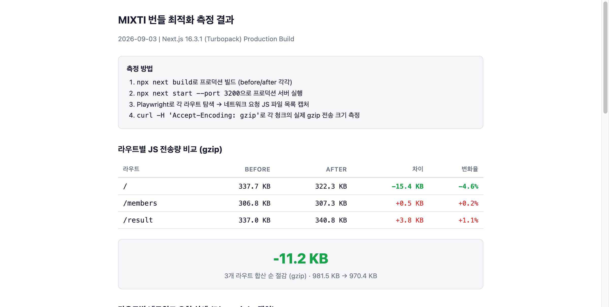
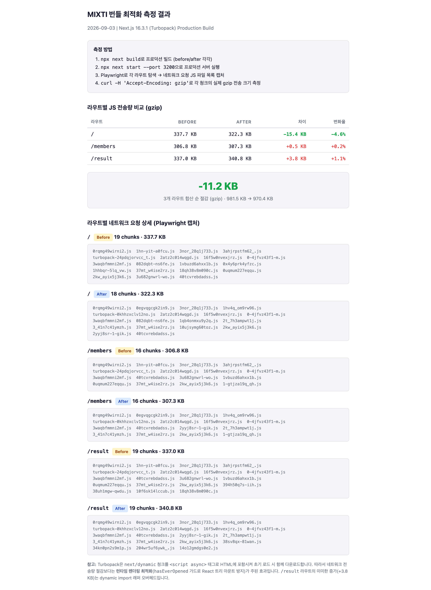

# 번들/렌더링 성능 최적화 (§15)

> 2026-09-02 | 목표: 초기 JS 번들 ~22-28KB gzip 절감

## 배경

Lighthouse 99 (localhost), RUM LCP 1.82s / INP 45ms 달성 상태.
사용자 인터랙션 시에만 필요한 코드를 지연 로딩하고 불필요한 클라이언트 번들 포함을 제거한다.

---

## Phase 1: Quick Wins — 완료

### 1-A. Button `'use client'` 제거

- `src/shared/ui/button/button.tsx` — `cn()`만 사용, hook/state 없음 → 제거 완료

### 1-B. Zustand 셀렉터 적용 (2곳)

- `group-type-selector.tsx` — whole-store 구독 → 개별 셀렉터 완료
- `member-setup-form.tsx` — whole-store 구독 → 개별 셀렉터 완료

---

## Phase 2: Dynamic Import — 완료

### 핵심 패턴

BottomSheet가 React 19 `Activity` API를 사용 (`mode='hidden'`에서도 하위 트리 렌더링).
**`next/dynamic` + `hasEverOpened` 가드** 조합 필수.

### 대상

| 컴포넌트 | 파일 | 절감 (gzip) | 상태 |
|---------|------|------------|------|
| SaveAnalysisSheet | `result-view.tsx` | ~18-23KB | 완료 |
| GuestSavePromptSheet | `result-view.tsx` | ~2-3KB | 완료 |
| MbtiPicker | `member-setup-form.tsx` | ~1.5KB | 완료 |
| MbtiPicker | `settings-form.tsx` | ~1.5KB | 완료 |
| MbtiSetupPromptSheet | `home-header.tsx` | - | 완료 |

---

## Phase 3: result-view.tsx 분해 — 완료

### 추출 결과

| 파일 | 책임 | 행수 |
|------|------|------|
| `hooks/use-result-save.ts` | 저장 관련 state 8개 + 핸들러 6개 | 253 |
| `result-hero.tsx` | 그린 헤더 (ScoreGauge, tagline, summary, MBTI 뱃지) | 70 |
| `result-metrics-section.tsx` | MetricBar 카드 | 22 |
| `result-actions-footer.tsx` | 저장/공유/재테스트 버튼 | 55 |

### 결과

- `result-view.tsx`: **655행 → 399행** (39% 감소)
- useState: 8개 → 0개 (전부 `useResultSave` 훅으로 이동)
- 저장 로직 완전 분리, 뷰 레이어는 조합만 담당

---

## 실측 결과

### 측정 방법

1. `npx next build`로 프로덕션 빌드 (before/after 각각)
2. `npx next start --port 3200`으로 프로덕션 서버 실행
3. Playwright로 각 라우트 탐색 → 네트워크 요청 JS 파일 목록 캡처
4. `curl -H 'Accept-Encoding: gzip'`로 각 청크의 실제 gzip 전송 크기 측정

### 라우트별 JS 전송량 (gzip)

| 라우트 | Before | After | 차이 | 변화율 |
|--------|--------|-------|------|--------|
| `/` | 337.7 KB | 322.3 KB | **-15.4 KB** | **-4.6%** |
| `/members` | 306.8 KB | 307.3 KB | +0.5 KB | +0.2% |
| `/result` | 337.0 KB | 340.8 KB | +3.8 KB | +1.1% |
| **합산** | **981.5 KB** | **970.4 KB** | **-11.2 KB** | **-1.1%** |

### Turbopack 한계

Turbopack은 `next/dynamic` 청크를 `<script async>` 태그로 HTML에 포함시켜 초기 로드 시 함께 다운로드한다. 따라서 네트워크 전송량 절감보다는 **런타임 렌더링 최적화**(`hasEverOpened` 가드로 React 트리 마운트 방지)가 주된 효과다. `/result` 라우트의 미미한 증가(+3.8 KB)는 dynamic import 래퍼 오버헤드.

### 측정 스크린샷

- 요약: 
- 상세 (청크 목록 포함): 
